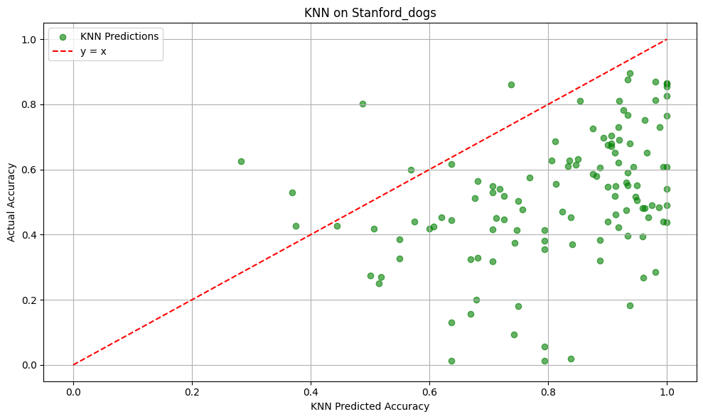

# Towards the Text Priors in CLIP Model for Predicting Zero-Shot Classification Performance

## Introduction

In this blog post, we explore the influence of text priors on the zero-shot classification performance of the CLIP (Contrastive Language-Image Pre-training) model. Our primary goal is to determine whether we can predict the zero-shot accuracy of CLIP for different classes using only text-based information, without relying on any image data.

## Motivation

For humans, it's natural to get a sense of "classifiability" of a category by only reading its name. For example, we can easily predict that the zero-shot accuracy of "Northern cardinal" is higher than "Tennessee Warbler" and "the Orange-crowned Warbler" before actually seeing the images in the dataset (if we have the prior knowledge we can "imagine" the images and say classify Northen Cardinal is much easier than the other two).

<!-- show some example images in a row -->
<div style="display: flex; justify-content: space-around;">

  <div style="text-align: center;">
    
    <p>Northern Cardinal</p>
  </div>

  <div style="text-align: center;">
    
    <p>Tennessee Warbler</p>
  </div>

  <div style="text-align: center;">
    
    <p>Orange-crowned Warbler</p>
  </div>

</div>

So, can the CLIP model make similar inferences using only text information? **Optimistically speaking, Yes.**

Our belief comes from our finding that the distribution of text embedding correlates the disbribution of image embedding. 

We use GPT-4o-mini to genrate alternative captions for each class to estimate the text distribution. For example, for Acadian Flycatcher:

```python
{
    "captions": [
        "Acadian Flycatcher perched gracefully on a branch, showcasing its olive-green back and distinctive yellow underparts.",
        "A small but agile Acadian Flycatcher darting through the lush understory of a deciduous forest in search of insects.",
        "The Acadian Flycatcher, a member of the Tyrannidae family, nestled among vibrant foliage in its temperate woodland habitat.",
        "Beautifully camouflaged in the forest, an Acadian Flycatcher with subtle grayish wings and bright yellow throat sings melodiously.",
        "An Acadian Flycatcher actively foraging for insects, highlighted against the rich green backdrop of summer woodland.",
        "The territorial Acadian Flycatcher calling out from its favorite singing perch as spring arrives in North America.",
        "With a wingspan of around 8.5 to 9.5 inches, the Acadian Flycatcher is a small bird making big impressions with its calls.",
        "Spotting an Acadian Flycatcher in its breeding season is special; this bird favors moist, wooded habitats in the eastern U.S.",
        "The Acadian Flycatcher's diet includes a variety of insects, supplemented by the occasional berry during the nesting season.",
        "Acadian Flycatchers breed in pairs, constructing cup-shaped nests made of plant fibers and spider silk in the low shrub layer.",
        "A glimpse of the elusive Acadian Flycatcher as it flits between branches, demonstrating its agile flying behavior.",
        "During migration, these flycatchers travel long distances, often reaching southern regions of Central America for the winter.",
        "An Acadian Flycatcher showcasing its characteristic 'peas- peas- peas' call amidst the springtime chorus of songbirds.",
        "Juvenile Acadian Flycatchers can be seen learning to fly and hunt under the watchful eyes of their parents in the dense underbrush.",
        "In the quiet wetlands of the northeastern United States, the Acadian Flycatcher thrives on its diet of flying insects.",
        "The Acadian Flycatcher's striking yellow belly and olive upperparts create a stunning contrast against dappled sunlight in the forest.",
        ...
    ]
}
```

**Then, we have the text distribution vs image distribution plot:**


We use 'x' to mark the text embeddings and 'o' to mark the image embeddings. We can see that the clustering patterns and the relative positions of the two modalities correspond closely.

Thus, the rationale behind this post is that the text prior of the class name is already sufficient to give us a decent prediction of the zero-shot accuracy for each class.


### Methodology: GPT-based Distribution Estimation and Soft K-Nearst Neighbors (KNN) Prediction

TL;DR: 

1. We use gpt-4o-mini for fast alternative caption generation. Our intention is to use the text embeddings of these captions to represent the "distribution" of each class.
2. We trained a soft KNN to produce the probability of how much a sample belongs to each class. Let's denote $\mathcal{K}(x|C)$ as the soft KNN's predicted probability of $x\in C$, here $x$ is a sample (typically, a text embedding) and $C$ is a class. The Predicted zero-shot Accuracy of class $C$ is computed by averaging the probability (aka confidence) of all samples in the class $C$:

$$P(C) = \frac{1}{|C|}\sum_{x\in C} \mathcal{K}(x|C)$$


### Experimental Results and Limitations in Pure Text-based Prediction

We show the comparison of Corr. between our new text approach and the Text CS&CM in our AAAI submission. **We note that, our soft KNN directly predicts the zero-shot accuracy of each class**, while the old version computes a consistency score. Even in this setup, the soft KNN method has a higher Corr.


| Dataset                 | Text CS | Text CM | soft KNN |
|-------------------------|---------|---------|----------|
| CUB-200                 | 0.49    | 0.47    | **0.55** |
| Stanford Dogs           | 0.37    | 0.38    | **0.44**    |
| Flowers-102             | 0.24    | 0.27    | **0.32**  |
| RESISC45                | 0.33    | 0.41 | **0.43**       |

*Comparison of Text CS, Text CM, and soft KNN across different datasets. Values represent Spearman's coefficient between similarity and recall@1. The highest value in each row is highlighted in bold.*


**We list several limitations of our method:**


1. The results not robust. They are sensitive to multiple factors/hyper-parameters including the prompt used to generate the alternative captions, the number of alternative captions generated, the fraction of the training data for training the soft KNN and compute the predicted zero-shot accuracy, etc.

2. The "over-estimation" issue. The predicted zero-shot accuracy is generally higher than the actual zero-shot accuracy for most experiments. We consider our method as an "upper-bound" estimation since the actual zero-shot accuracy can be affected by many factors, such as the quality of the images.




3. The vision-text representation of the CLIP model isn't perfect. There is a gap between the text embeddings and the image embeddings [1] which hinder our method that use text embeddings to mimic image embeddings.

A promising method may be using diffusion model to convert text embeddings to image embeddings to bridge the gap Considering the diffusion model as a distribution transformation model [2], we don't even need the generated images "close" to the actual images, just converting the modality from text to image is sufficient.


### References

1. Liang, Victor Weixin, et al. "Mind the gap: Understanding the modality gap in multi-modal contrastive representation learning." Advances in Neural Information Processing Systems 35 (2022): 17612-17625.
2. Lipman, Yaron, et al. "Flow Matching for Generative Modeling." The Eleventh International Conference on Learning Representations.


### Experiment Details

- Model: "openai/clip-vit-base-patch32"
- Number of alternative captions generated for each class: 100
- Example meta prompt for alternative caption generation:


> "You are an AI assistant that generates creative and diverse image captions suitable for use with image generation models like DALL-E. Given a [class name], provide 32 distinct and descriptive captions. Consider the following global taxonomical traits when generating captions: [list of traits]."

### Visualization of the Alternative Captions

Using SDXL-lightning to visualize the alternative captions generated by GPT-4o-mini.

<div style="display: flex; justify-content: space-around;">
  <div style="text-align: center;">
    
    <p>Northen Cardinal</p>
  </div>

  <div style="text-align: center;">
    
    <p>Tennessee Warbler</p>
  </div>

  <div style="text-align: center;">
    
    <p>Orange crowned Warbler</p>
  </div>
</div>

